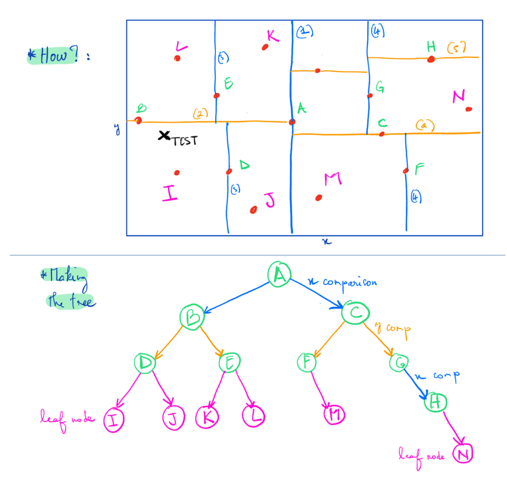

# Project Implementation: Segmentation Based Classification of 3D Urban Point Clouds

This project implements the methodology described in *"Segmentation Based Classification of 3D Urban Point Clouds"*. The system transforms raw 3D point cloud data into semantically classified objects (Buildings, Trees, Poles, Cars, Ground) using a bottom-up voxelisation and segmentation approach.

## 1. Data Acquisition and Preprocessing

The point cloud data is sourced from the **Semantic3D** benchmark. Specifically, the `domfountain_station2` dataset is used.

-   **Input**: Raw 3D point cloud data containing spatial coordinates ($x, y, z$), RGB color, and reflectance intensity.
-   **Process**: The data (41,268,288 points) is loaded efficiently using optimized C-engine parsing.

---

## 2. Voxelisation (Radius Nearest Neighbor)

The data complexity is reduced by grouping raw points into "super-voxels" (s-voxels) using the **r-NN (Radius Nearest Neighbor)** method.

### 2.1 Conceptual Framework

The r-NN method employs a "shrink-wrapping" strategy (bottom-up):
-   **No fixed grid**: Voxels are created only where data exists.
-   **Adaptive Size**: The voxel boundaries ($s_x, s_y, s_z$) shrink to fit the points exactly.

### 2.2 Mathematical Formulation

The global set of points $\mathcal{S}$ is iteratively processed to generate s-voxels $V$ with a fixed radius **$r = 0.1$ m**:

1.  **Seed Selection**: A random center point $P_{seed}$ is selected from $\mathcal{S}$.
2.  **Neighborhood Search**: All points $P_k$ within distance $r$ are identified:
    $$ \| P_k - P_{seed} \|_2 \le 0.1 $$
3.  **Voxel Formation**: The resulting voxel is an Axis-Aligned Bounding Box (AABB) defined by the min/max coordinates of these neighbors.
4.  **Exclusion Principle**: These points are removed from $\mathcal{S}$ immediately, ensuring strict partitioning.

---

## 3. Transformation into Super-Voxels

Each voxel is transformed into a "super-voxel" (s-voxel) by calculating specific attributes essential for segmentation.

### 3.1 Geometric Center & Means
The centroid and mean properties are computed:
$$ V_{X,Y,Z} = \frac{1}{m} \sum_{k=1}^{m} \mathbf{P}_k $$
This yields the distinct features: $V_x, V_y, V_z$ (position), $V_r, V_g, V_b$ (color), and $V_I$ (intensity).

### 3.2 Variances
To quantify homogeneity, variances are calculated:
$$ \sigma^2 = \frac{1}{m-1} \sum_{k=1}^{m} (val_k - V_{val})^2 $$
Yielding: $V_{var\_r}, V_{var\_g}, V_{var\_b}, V_{var\_I}$.

### 3.3 Surface Normal Estimation (PCA)
The surface orientation is derived using **Principal Component Analysis (PCA)**.
1.  **Covariance Matrix**: The covariance matrix $\mathbf{C}$ of the XYZ coordinates is computed.
2.  **Eigen Decomposition**: The equation $\mathbf{C} \mathbf{v} = \lambda \mathbf{v}$ is solved.
3.  **Normal Selection**: The eigenvector corresponding to the **smallest eigenvalue** ($\lambda_{min}$) is selected as the surface normal $\vec{n} = (n_x, n_y, n_z)$.

---

## 4. Implementation Strategy

To ensure efficiency, the implementation uses the following specific designs:

### 4.1 Spatial Indexing: K-Dimensional Tree (KD-Tree)

Calculating Euclidean distances is an $\mathcal{O}(N)$ operation per seed. A **KD-Tree** is used to perform radius queries in logarithmic time ($\mathcal{O}(\log N)$).

#### Algorithm: Construction
The KD-Tree recursively divides the dataset:
1.  **Axis Cycling**: The splitting axis cycles $x \to y \to z$.
2.  **Median Splitting**: The median point defines the splitting plane.
3.  **Recursive Partitioning**: Points are directed to Left/Right subtrees based on the pivot.
4.  **Termination**: Recursion stops at the leaf size threshold.

#### Visualization

*Figure 1: Illustration of 2D KD-Tree construction. (Top) Recursive subdivision by hyperplanes. (Bottom) Corresponding binary tree structure.*

#### Mathematical Efficiency
This structure allows the algorithm to prune vast spatial regions.
-   **Construction**: $\mathcal{O}(N \log N)$
-   **Range Query**: Average case $\mathcal{O}(\log N)$

### 4.2 Other Optimization Strategies
-   **Visited Mask**: A boolean array tracks assigned points to avoid expensive row deletions.
-   **Vectorization**: `numpy` and `pandas` execute batch calculations for means and variances.
-   **Scipy Implementation**: `scipy.spatial.cKDTree` provides the C++ backend for performance.

---

## 5. Segmentation via Link-Chain Method

Adjacent s-voxels are clustered into distinct objects based on attributes.
-   **Linkage**: A principal link connects to secondary links (neighbors).
-   **Constraints**: s-voxels are linked if they satisfy thresholds for:
    -   Spatial Adjacency ($D_{spatial} < T_d$)
    -   Color Similarity ($D_{color} < T_c$)
    -   Intensity Similarity ($D_{intensity} < T_i$)

## 6. Classification

Class labels (Building, Road, Pole, Car, Tree) are assigned to segments using geometric descriptors.
-   **Ground Removal**: The manufacturing ground plane is identified and removed first.
-   **Descriptors**:
    -   *Buildings*: Defined by normals $\parallel$ Ground.
    -   *Poles*: Defined by vertical linearity.
    -   *Trees*: Defined by distributed barycenters (height differences).
